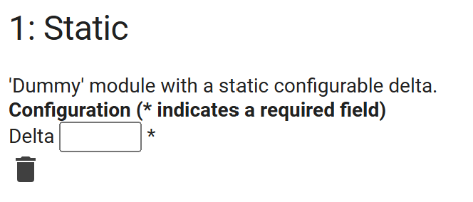

# Module configuration

> Main page: [Configuration](configuration.md) 
> Previous: [Zone configuration](configuration-zones.md) 
> Next: [Sensor group configuration](configuration-sensor-groups.md)

Add one or more modules that calculate irrigation duration. Each module comes with its own configuration and can be used to calculate duration for one or more [zones](configuration-zones.md). Modules can't be deleted if they are used by one or more zones.

## Adding a module
Select a module type and select `Add module`. Once added, you can configure the module

## Configuring a module
The following modules are available:
- **PyETO**: Calculate duration based on the FAO56 calculation from the PyETO library. The following options are available:
    - _Coastal_: If the location you are tracking is situated on or adjacent to coast of a large land mass or anywhere else where air masses are influenced by a nearby water body, enable this setting.
    - _Solrad behavior_: Determine how you want to retrieve or estimate solar radiation. This might take some experimentation to figure out what works best for you. There are multiple options available:
        - `Estimate from temperature`: estimate solar radiation from temperature. Any solar radiation value provided by your [sensor group](configuration-sensor-groups.md) is ignored.
        - `Estimate from sun hours`: estimate solar radiation from the number of sun hours. Any solar radiation value provided by your [sensor group](configuration-sensor-groups.md) is ignored.
        - `Do not estimate`: This requires a solar radiation sensor in the [sensor group](configuration-sensor-groups.md) to be configured. Since many weather stations and weather services don't provide this information, it's likely you'll want to instead use one of the 'estimate' options.
        - `Estimate from average of sun hours and temperature`: estimate the solar radiation from both the sun hours and temperature. Any solar radiation value provided by your [sensor group](configuration-sensor-groups.md) is ignored.
  - _Forecast days_: How many forecast days taken into account. This is useful to avoid irrigating if the forecast suggests it will rain.
- **Static**: static configurable nett precipitation. Enter the nett precipitation in the `Delta` box.
- **Passthrough**: Return the value of an evapotranspiration sensor as delta. Passthrough takes your evapotranspiration sensor and returns its value. It bypasses all calculations, except aggregates. This requires a solar radiation source to be configured in your [sensor groups](configuration-sensor-groups.md).

## Deleting a module

Use the button at the bottom to delete a module. Note you can only delete modules that are not used by any [zones](configuration-zones.md).

> Main page: [Configuration](configuration.md) 
> Previous: [Zone configuration](configuration-zones.md) 
> Next: [Sensor group configuration](configuration-sensor-groups.md)
