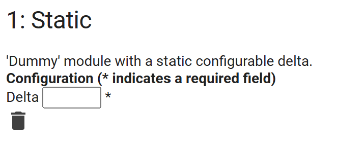

# Module configuration

> Main page: [Configuration](configuration.md) 
> Previous: [Zone configuration](configuration-zones.md) 
> Next: [Sensor group configuration](configuration-sensor-groups.md)

A module is the method used to work out how much water evaporated. You pick one per [sensor group](configuration-sensor-groups.md), and every zone using that group inherits it. A module cannot be deleted while something still uses it.

## The three modes

They differ in one thing: where the evapotranspiration figure comes from. Everything after that, the water balance, the rain, the duration, is the same whichever you choose.

| Mode | Where the figure comes from | What you need |
| --- | --- | --- |
| **Manual** | You give one number, used every day | Nothing |
| **Standard** | An evapotranspiration figure that already exists | A weather service that publishes one, or your own sensor |
| **Advanced** | Computed from the weather, by FAO-56 Penman-Monteith | Temperature, humidity, pressure and wind, ideally solar radiation |

If you are unsure, **Standard** with Open-Meteo is the shortest path to something correct: it is free, needs no API key, and publishes a reference evapotranspiration computed the same way Advanced would.

> In the logs, the services and the stored configuration these are still called `Static`, `Passthrough` and `PyETO`. The names above are what the panel shows.

### Manual

A fixed amount of evaporation per day, which you set yourself in the **Delta** box. No sensors and no weather service.

It is coarser than the other two, but it is not the same as no integration at all: rain still counts against it, the water balance still tracks what you have already applied, and the duration still follows from your zone's size and throughput. Somewhere around 4 to 5 mm a day is a common starting point for a temperate summer, and worth adjusting by season.

### Standard

Takes an evapotranspiration figure that already exists and uses it as it stands.

Two ways to feed it. Either a weather service that publishes one, which today means **Open-Meteo** among the three supported, or a sensor of your own that reports evapotranspiration. Set the **Evapotranspiration** source in the sensor group accordingly.

Rain still counts: the water balance is the evapotranspiration from this figure minus the precipitation your sensor group reports. Nothing else is required, and the group will not ask you for temperature or wind, because this mode never reads them.

### Advanced

The full FAO-56 Penman-Monteith calculation, from the individual weather quantities. The most accurate option when your sensors sit where the plants are, and the one that asks for the most.

It reads temperature, dewpoint, humidity, pressure, wind speed and solar radiation from the sensor group. Solar radiation is the term that drives the result: when a source provides it, it is used; when none does, it is estimated from the daily temperature range, which is coarser but still workable. Under glass, a light sensor can stand in for a radiation sensor, described under [sensor groups](configuration-sensor-groups.md).

Two settings of its own:

- _Coastal_: enable it if your location is on or near the coast of a large land mass, or anywhere air masses are influenced by a nearby body of water. It adjusts the radiation estimate.
- _Forecast days_: how many forecast days to fold into the calculation, so a run can be reduced ahead of rain that has not fallen yet. Requires a weather service.

## Adding a module

Select a mode and choose `Add module`. It can then be configured, and picked from any sensor group.

Most people never need to come here: the **Setup** tab creates the module, the sensor group and the zone together, from what you answer.

## Deleting a module

Use the button at the bottom. A module can only be deleted once nothing uses it.

> Main page: [Configuration](configuration.md) 
> Previous: [Zone configuration](configuration-zones.md) 
> Next: [Sensor group configuration](configuration-sensor-groups.md)
