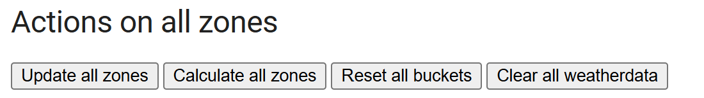

# Zone configuration

> Main page: [Configuration](configuration.md) 
> Previous: [General configuration](configuration-general.md) 
> Next: [Module configuration](configuration-modules.md)

Specify one or more irrigation zones here. The integration calculates irrigation duration per zone, depending on size, throughput, state, [module](configuration-modules.md) and [sensor group](configuration-sensor-groups.md). A zone can be:
* **disabled**: The zone is then not calculated and duration will be set to 0.
* **automatic**: The zones duration is automatically calculated.
* **manual**: You can specify the zones duration yourself.

> When entering any values in the configuration of this integration, take notice of the labels provided so you enter values in the correct units.

## Multi-zone support
For irrigation systems that have multiple zones which you want to run in series or independent you need to create multiple zones. The configuration should be done for each zone, including the area the zone covers and the corresponding settings.

## Adding a zone
You need to specify the following to add a zone:

- **Name**: The name of your zone, e.g. 'garden'
- **Size**: The size of this zone (m2 or sq ft)
- **Throughput**: The flow of this zone (liter/minute or gallon/minute)

After entering the information, click `Add zone` to add the zone.
Each zone is shown as an entity in Home Assistant.
After adding a zone, make sure to further configure your new zone.

## Actions on all automatic Zones

You can perform the following actions on all automatic zones: 
- **Update all zones**: Retrieve the weather data for all [sensor groups](configuration-sensor-groups.md) for all automatic zones.
- **Calculate all zones**: Calculate irrigation duration for all automatic zones. This will also delete weather data after calculation.
- **Reset all buckets**: Set the buckets for all automatic zones to `0`.
- **Clear all weatherdata**: Remove all collected weather data for the [sensor groups](configuration-sensor-groups.md) used by any automatic zone.

## Configuring a zone
You can change the following settings on a zone:

- **Name**: change the name of a zone
- **Size**: change the size of a zone
- **Throughput**: change the throughput of a zone
- **Drainage rate**: set the drainage rate of a zone. This will only be applied if bucket > 0. Full drainage rate only occurs when the bucket is at its maximum value and before that it will be applied as a fraction of the drainage rate, following hydraulic conductivity method of [Brooks and Corey, Eq. 4-6](https://open.library.okstate.edu/rainorshine/chapter/1-8-models-for-soil-hydraulic-conductivity/). Use this if you have drainage problems. You will need to do some experimentation to see what value works for you. Too low of a value and your drainage problem is not solved, too high of a value and the effects of the evapotranspiration calculation has little to no impact. Keep in mind that the values quoted on the internet (around 50.8 mm or 2 inch per hour) for drainage rates are dependent on your soil type and are for fully saturated soil only. It's recommended to start with 0 mm/h and if you have draingage problems, increase it by approx 5 mm/h each 24 hours until you arrive at a level of irrigation that waters your area and doesn't cause puddles to appear. Since this is so dependent on your soil characteristics you will need to do some experimentation to arrive at the optimal value.
- **State**:
  - _Automatic_: Automatic updating and calculation of that zone. [module](configuration-modules.md) and [sensor group](configuration-sensor-groups.md) is mandatory.
  - _Manual_: Only manual updating and calculation of that zone. No [module](configuration-modules.md) and [sensor group](configuration-sensor-groups.md) is required.
  - _Disabled_: The zone is disabled. No updating and calculation of that zone. Setting a [module](configuration-modules.md) and [sensor group](configuration-sensor-groups.md) on the zone is optional.
- **Module**: Choose the [calculation module](configuration-modules.md) that should be used to calculate irrigation for the zone.
- **Sensor group**: Choose the [sensor group](configuration-sensor-groups.md) that provides the weather data for this zone.
- **Bucket**: Either calculated or manually set. If `bucket >= 0` then no irrigation is necesarry, if `bucket < 0` irrigation is necessary. See [automations](automations.md) for examples on how to use this value to decide to irrigate.
- **Maximum bucket**: A cap on the **surplus** side of the bucket, so it only ever applies when `bucket > 0`, meaning the soil is already at field capacity. It is how much water the ground can hold on to above field capacity before the rest runs off or drains past the roots, and it doubles as the saturation reference for the drainage curve. It is not the total water your soil can hold for the plant, and it has no effect on the deficit side, so it never changes when a zone starts watering. The recommended value is based on the type of soil:
    - clay soil: 30 mm (1.18")
    - sandy soil: 12 mm (0.47"). 
These come from how much water each soil type retains above field capacity before the excess is lost. See [this discussion for more details](https://github.com/altmenorg/HAsmartirrigation/discussions/448).

- **Lead time**: Time needed to warm up your irrigation system (in seconds), e.g. time to establish a connection, start a pump, build pressure, etc. After the duration is calculated, the lead time is added but only if the duration is > 0.
- **Maximum duration**: The maximum duration of the irrigation, to avoid flooding, wasting water, etc.
- **Multiplier**: The crop factor Kc. It scales the evapotranspiration to the water your crop actually uses, `ETc = ET0 * Kc`, so the bucket is depleted at the crop's rate rather than the reference one. It is applied to the evapotranspiration and not to the rain that fell on it, nor to the resulting duration. For lawns, it is recommended to set the multiplier depending on your grass type (See [this discussion for more details](https://github.com/altmenorg/HAsmartirrigation/discussions/448)):
    * Cool-reason grasses (such as fescue, bluegrass) should be set to `0.8`
    * Warm-season grasses (such as bermuda, zoysia) should be set to `0.7`.

    A dry spell waters the same as it always did: the crop factor ends up multiplying the same total either way. What changes is a period with rain, where a factor below 1 used to credit only that fraction of the millimetres that fell and therefore over-watered, and the moment irrigation becomes necessary, which now arrives at the crop's rate of depletion rather than about `1/Kc` times too early.
- **Irrigation threshold**: how much of a soil moisture deficit to let build up before watering at all, in mm or inch. `0`, the default, waters as soon as anything is missing, which suits a lawn. A tree or a hedge wants the opposite: set a threshold and the zone stays dry until that much water is owed, then delivers all of it in one deep run. It changes *when* a zone waters, not *how much*: once the threshold is reached the run still covers the whole deficit. It follows that a zone never waters less than its threshold, so it also rules out very short runs. In soil terms this is the management allowed depletion (MAD).

To pick a value, work from the water your soil actually holds for the plant, the total available water: `TAW = available water capacity of the soil x root depth`. As a rough guide the available water capacity runs about 60 to 90 mm per metre in sand, 130 to 170 in loam and 150 to 200 in clay, and the root depth is what matters for that planting, perhaps 0.15 to 0.3 m for turf and a metre or more for an established tree. The threshold is then a fraction of that, `p x TAW`, with `p` around 0.5 as a starting point (FAO-56 gives per-crop values, mostly between 0.4 and 0.6). A lawn on loam at 0.2 m therefore lands somewhere near 15 mm.

Do **not** derive it from the **Maximum bucket**: that setting caps the surplus above field capacity, which is the other side of zero and a different quantity entirely.

The default of `0` is there to keep existing installs behaving exactly as before, not because watering the instant anything is missing is good practice. Deep and infrequent watering suits a lawn too, it simply wants a smaller threshold than a tree because its roots are shallower.
- *Duration*: Irrigation duration in seconds. Either calculated or manually set.

### Available actions per zone

Below each zone there are some buttons, to perform the following tasks:

* update weather data. This collects weather data from the sensor group for the zone.
* calculate irrigation duration. Note that if you calculate irrigation duration using the buttons per zone, the weather data for the sensor group for that zone is deleted. 
* after a calculation there is also a button to get some information how duration was calculated, which gives insight into how the bucket was updated, and how the crop factor and lead time influenced the result.
* view weather data. View the last 10 records of the associated sensor group.
* view watering calendar. View a yearly watering calendar based on the location and normal weather patterns.
* delete the zone. 

> Main page: [Configuration](configuration.md) 
> Previous: [General configuration](configuration-general.md) 
> Next: [Module configuration](configuration-modules.md)
