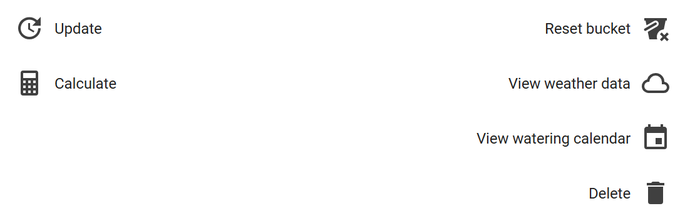

# Zone configuration

> Main page: [Configuration](configuration.md) 
> Previous: [General configuration](configuration-general.md) 
> Next: [Module configuration](configuration-modules.md)

Specify one or more irrigation zones here. The integration calculates irrigation duration per zone, depending on size, throughput, state, [module](configuration-modules.md) and [sensor group](configuration-sensor-groups.md). A zone can be:
* **disabled**: The zone is then not calculated and duration will be set to 0.
* **automatic**: The zones duration is automatically calculated.
* **manual**: You can specify the zones duration yourself.

> When entering any values in the configuration of this integration, take notice of the labels provided so you enter values in the correct units.

## Multi-zone support
For irrigation systems that have multiple zones which you want to run in series or independent you need to create multiple zones. The configuration should be done for each zone, including the area the zone covers and the corresponding settings.

## Adding a zone
You need to specify the following to add a zone:

- **Name**: The name of your zone, e.g. 'garden'
- **Size**: The size of this zone (m2 or sq ft)
- **Throughput**: The flow of this zone (liter/minute or gallon/minute)

After entering the information, click `Add zone` to add the zone.
Each zone is shown as an entity in Home Assistant.
After adding a zone, make sure to further configure your new zone.

## Actions on all automatic Zones

You can perform the following actions on all automatic zones: 
- **Update all zones**: Retrieve the weather data for all [sensor groups](configuration-sensor-groups.md) for all automatic zones.
- **Calculate all zones**: Calculate irrigation duration for all automatic zones. This will also delete weather data after calculation.
- **Reset all buckets**: Set the buckets for all automatic zones to `0`.
- **Clear all weatherdata**: Remove all collected weather data for the [sensor groups](configuration-sensor-groups.md) used by any automatic zone.

## Configuring a zone
You can change the following settings on a zone:

- **Name**: change the name of a zone
- **Size**: change the size of a zone
- **Throughput**: change the throughput of a zone
- **Drainage rate**: set the drainage rate of a zone. Use this only if you have drainage problems. You will need to do some experimentation to see what value works for you. Too low of a value are your drainage problem is not solved, too high of a value and the effects of the evapotranspiration calculation has little to no impact. Keep in mind that the values quoted on the internet (around 50.8 mm or 2 inch per hour) for drainage rates are dependent on your soil type and are for fully saturated soil only. It's recommended to start with 0 mm/h and if you have draingage problems, increase it by approx 5 mm/h each 24 hours until you arrive at a level of irrigation that waters your area and doesn't cause puddles to appear. Since this is so dependent on your soil characteristics you will need to do some experimentation to arrive at the optimal value.
- **State**:
  - _Automatic_: Automatic updating and calculation of that zone. [module](configuration-modules.md) and [sensor group](configuration-sensor-groups.md) is mandatory.
  - _Manual_: Only manual updating and calculation of that zone. No [module](configuration-modules.md) and [sensor group](configuration-sensor-groups.md) is required.
  - _Disabled_: The zone is disabled. No updating and calculation of that zone. Setting a [module](configuration-modules.md) and [sensor group](configuration-sensor-groups.md) on the zone is optional.
- **Module**: Choose the [calculation module](configuration-modules.md) that should be used to calculate irrigation for the zone.
- **Sensor group**: Choose the [sensor group](configuration-sensor-groups.md) that provides the weather data for this zone.
- **Bucket**: Either calculated or manually set. If `bucket >= 0` then no irrigation is necesarry, if `bucket < 0` irrigation is necessary. See [automations](automations.md) for examples on how to use this value to decide to irrigate.
- **Maximum bucket**: You can manually set a maximum bucket size. The maximum recommended bucket size is based on the type of soil:
    - clay soil: 30 mm (1.18")
    - sandy soil: 12 mm (0.47"). 
This recommendation is based on the soil water holding capacity. See [this discussion for more details](https://github.com/jeroenterheerdt/HAsmartirrigation/discussions/448).

- **Lead time**: Time needed to warm up your irrigation system (in seconds), e.g. time to establish a connection, start a pump, build pressure, etc. After the duration is calculated, the lead time is added but only if the duration is > 0.
- **Maximum duration**: The maximum duration of the irrigation, to avoid flooding, wasting water, etc.
- **Multiplier**: Multiplies / divides the duration of the irrigation. For lawns, it is recommended to set the multiplier depending on your grass type (See [this discussion for more details](https://github.com/jeroenterheerdt/HAsmartirrigation/discussions/448)):
    * Cool-reason grasses (such as fescue, bluegrass) should be set to `0.8`
    * Warm-season grasses (such as bermuda, zoysia) should be set to `0.7`. 
- *Duration*: Irrigation duration in seconds. Either calculated or manually set.

### Available actions per zone

Below each zone there are some buttons, to perform the following tasks (from left to right):

* update weather data. This collects weather data from the sensor group for the zone.
* calculate irrigation duration. Note that if you calculate irrigation duration using the buttons per zone, the weather data for the sensor group for that zone is deleted. 
* delete the zone. 
* after a calculation there is also a button to get some information how duration was calculated, which gives insight into how the bucket was updated, and how the lead time and multiplier influenced the calculated duration.

> Main page: [Configuration](configuration.md) 
> Previous: [General configuration](configuration-general.md) 
> Next: [Module configuration](configuration-modules.md)
