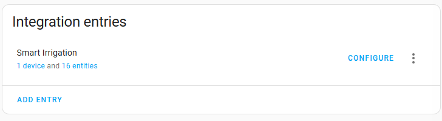

# Installation: Options

> Main page: [Installation](installation.md) 
> Next: [Updating the installed version](installation-updating.md)

To change which weather service you are using or to update your API key, follow these steps:
1. In Home Assistant go to Settings > Devices & services.
2. Select the 'Smart Irrigation' card.
3.  Under 'Integration entities' click `Configure`.
4. [Follow the instructions on screen, which are detailed in the installation docs](installation-weatherservice.md).

> Main page: [Installation](installation.md) 
> Next: [Updating the installed version](installation-updating.md)