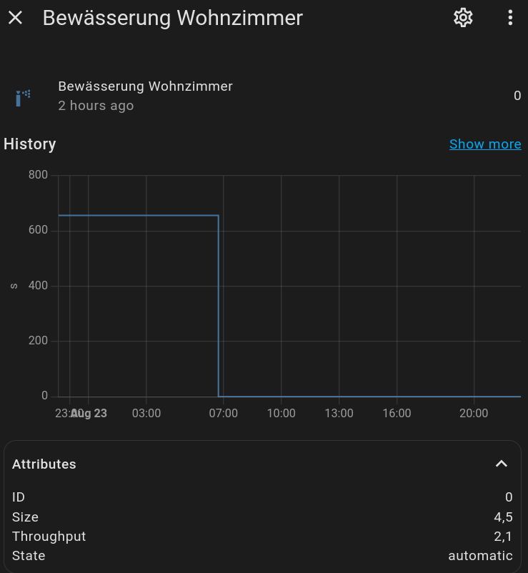

# Entities

> Main page: [Usage](usage.md) 
> Next: [Services](usage-services.md)

Each [zone](configuration-zones.md) you configure will be added as a sensor entity to Home Assistant. The sensor will be named as follows: `sensor.smart_irrigation_[zone_name]`. So if you have a zone called 'lawn' then the sensor would be named `sensor.smart_irrigation_lawn`.

Each entity will have the following attributes:

| Attribute | Description |
| --- | --- |
|`id`|internal identification|
|`size`|the total area the irrigation system reaches in m2 or sq ft.|
|`throughput`|total amount of water that flows through the irrigation system in liters or gallon per minute.|
|`input_method`|how the precipitation rate is determined: `throughput` (from size + throughput) or `direct` (entered directly).|
|`precipitation_rate`|the directly entered precipitation rate in mm/h or in/h, when `input_method` is `direct`.|
|`state`|disabled, manual, automatic |
|`bucket`|the bucket size in mm or inch|
|`et_value`|the **net precipitation** applied to the bucket by the last calculation, in mm or inch: the water need over the interval with the precipitation already subtracted from it. It is positive on a day where more rain fell than water evaporated. Despite its name this is not the evapotranspiration.|
|`et_deficiency`|the water need on its own, per day, before the interval scaling and before precipitation, in mm or inch. Negative, because it is what the soil lost. Unlike the bucket it does not depend on the calculation interval or on bucket resets, so this is the value to compare when trying out configurations.|
|`eto`|the same water need expressed as a reference evapotranspiration, which is `et_deficiency` without the sign. This is the positive number the literature and the weather services quote, so it is the one to compare against an external ET0 figure.|
|`unit_of_measurement`|seconds|
|`device_class`|duration|
|`icon`|default: mdi:sprinkler|
|`friendly_name`|Name of your zone.|

Sample screenshot:

If you want to expose these attributes as separate sensors, you can add [template sensors](https://www.home-assistant.io/integrations/template/#state-based-template-binary-sensors-buttons-images-numbers-selects-and-sensors) using a template like the following example for `bucket`:

`{{state_attr('sensor.smart_irrigation_your_zone_sensor_name', 'bucket')}}`

(Since the per-zone device was added, you can also just use the dedicated entities below instead of template sensors.)

## Per-zone device and entities

Each zone is also grouped as a **device** in Home Assistant (named after the zone), attached to the single **Smart Irrigation** hub device. Alongside the duration sensor above, the device exposes dedicated entities, so a zone reads as a set of entities rather than one attribute bag:

| Entity | Type | Description |
| --- | --- | --- |
| Duration (`sensor.smart_irrigation_[zone]`) | sensor | Calculated watering duration (seconds). This is the original entity: its `entity_id`, recorded history and attributes are preserved. |
| Bucket | sensor | Current soil water balance (mm/inch); negative means deficit. |
| Applied ET | sensor | ET applied to the bucket at the last calculation (daily et0 x elapsed interval + rain). |
| Daily ET deficiency | sensor | Raw daily reference ET (et0), independent of the interval and of rain. |
| Current drainage | sensor | Water drained as runoff at the last calculation. |
| Last irrigation | sensor (timestamp) | When the zone was last credited for a run. |
| Water used | sensor (water, total) | Cumulative water delivered to the zone (litres). |
| Multiplier | number | Editable per-zone multiplier, written to the store and used by the next calculation. |
| Irrigation needed | binary_sensor | On when the bucket is in deficit. |
| Watering now | binary_sensor | On while the zone's linked valve/switch is open. |
| Problem | binary_sensor | On when a valve problem was reported (e.g. it never opened); clears on the next successful run. |
| Calculate | button | Recalculate this zone now. |
| Reset bucket | button | Set the bucket to 0 ("I just watered, start from zero"). |
| Reset usage | button | Zero the cumulative water-used counter. |
| Irrigate now | button | Run this zone's valve for its calculated duration (only shown with direct valve control). The run credits the bucket, so the delivered water is accounted for and the next calculation irrigates less. |

The **Smart Irrigation hub device** also carries global action buttons: *calculate all zones*, *refresh weather*, and (with direct valve control) *irrigate all zones*.

These entities are **additive**: nothing was removed. The duration sensor keeps its `entity_id`, recorded history and attributes, so existing dashboards, automations and templates keep working. A one-time registry migration moves the duration sensor's internal `unique_id` to a stable per-zone scheme; the `entity_id` and history carry over.

The per-zone device/entity layout is inspired by [JustChr's Smart Irrigation fork](https://github.com/JustChr/HAsmartirrigation) (MIT).

> Main page: [Usage](usage.md) 
> Next: [Services](usage-services.md)
